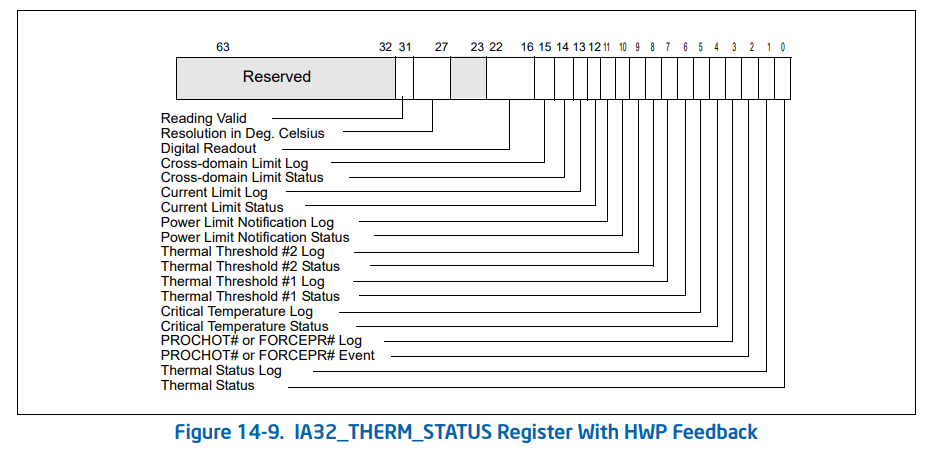

# Overview
This tool was created while working on a Thermal Throttling problem associated with Intel® Core™ i5-4300U Processor (formerly Haswell).  Since looking at data sheets required checking specific registers and bits it became useful to draw these in a formate that mimicked the data sheet.  For example, the image below is shown in a datasheet titled "Intel® 64 and IA-32 Architectures Software Developer’s Manual Volume  3B: System Programming Guide, Part 2".

A link to the problem description is the following:
https://software.intel.com/en-us/forums/software-tuning-performance-optimization-platform-monitoring/topic/815194

# Prerequiste
This tool is used in conjunction with Linux **msr-tools** because this tool allows one to read the Intel processor specific registers.

# Example(s)
TO DO: Add Content Here
