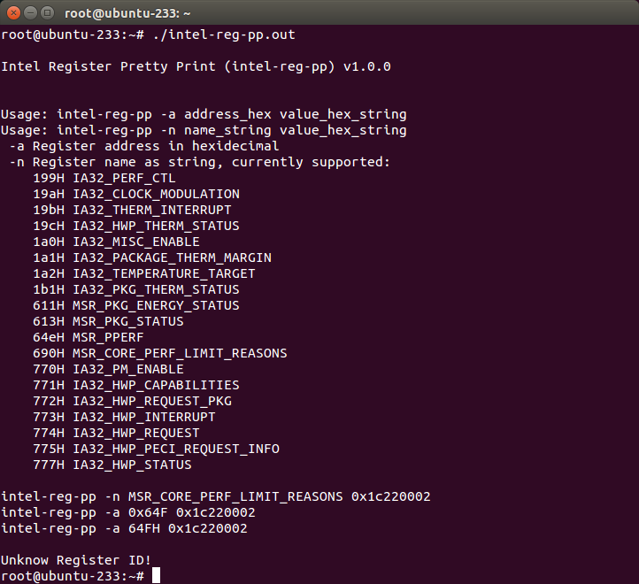
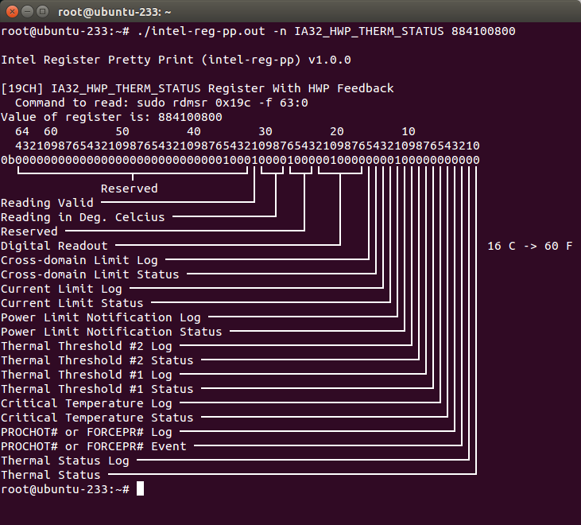

# Overview
This tool was created while working on a Thermal Throttling problem associated with Intel® Core™ i5-4300U Processor (formerly Haswell).  Since looking at data sheets required checking specific registers and bits it became useful to draw these in a formate that mimicked the data sheet.  For example, the image below is shown in a datasheet titled "Intel® 64 and IA-32 Architectures Software Developer’s Manual Volume  3B: System Programming Guide, Part 2".


A link to the problem description is the following:
https://software.intel.com/en-us/forums/software-tuning-performance-optimization-platform-monitoring/topic/815194

# Prerequiste
This tool is used in conjunction with Linux **msr-tools** because this tool allows one to read the Intel processor specific registers.  This tool was built using Visual Studio for Linux and tested on a Ubuntu 18.04.1 LTS x64 machine.

To install **msr-tools** run the following commands:
```
sudo apt-get update
sudo apt-get -y install msr-tools
```

After that initialize the MSR driver explicitly by running the following command:
```
sudo modprobe msr
```

Last, read a Intel Model Specific register (MSR) using the following command:
```
sudo rdmsr 0x19C -f 63:0
sudo strace rdmsr 0x19C -f 63:0
```

Take the hexidecimal output from the command and pass it to the **intel-reg-pp** application.
```
user1@ubuntu:~$ sudo rdmsr 0x19C -f 63:0
884100800
```


# Example(s)
The tool is quite simple.  To view the usage, simply place the binary on the system one wishes to execute and call it by name as shown below:
```
root@ubuntu-233:~# ./intel-reg-pp.out 

Intel Register Pretty Print (intel-reg-pp) v1.0.0


Usage: intel-reg-pp -a address_hex value_hex_string
Usage: intel-reg-pp -n name_string value_hex_string
 -a Register address in hexidecimal
 -n Register name as string, currently supported:
    199H IA32_PERF_CTL
    19aH IA32_CLOCK_MODULATION
    19bH IA32_THERM_INTERRUPT
    19cH IA32_HWP_THERM_STATUS
    1a0H IA32_MISC_ENABLE
    1a1H IA32_PACKAGE_THERM_MARGIN
    1a2H IA32_TEMPERATURE_TARGET
    1b1H IA32_PKG_THERM_STATUS
    611H MSR_PKG_ENERGY_STATUS
    613H MSR_PKG_STATUS
    64eH MSR_PPERF
    690H MSR_CORE_PERF_LIMIT_REASONS
    770H IA32_PM_ENABLE
    771H IA32_HWP_CAPABILITIES
    772H IA32_HWP_REQUEST_PKG
    773H IA32_HWP_INTERRUPT
    774H IA32_HWP_REQUEST
    775H IA32_HWP_PECI_REQUEST_INFO
    777H IA32_HWP_STATUS

intel-reg-pp -n MSR_CORE_PERF_LIMIT_REASONS 0x1c220002
intel-reg-pp -a 0x64F 0x1c220002
intel-reg-pp -a 64FH 0x1c220002

Unknow Register ID!
root@ubuntu-233:~# 
```

The output of this will indicate how to use it and what is supported as shown in the screenshot below.  


To show *pretty-print* of a particular register in this case *IA32_HWP_THERM_STATUS* run the command as shown below:
```
root@ubuntu-233:~# ./intel-reg-pp.out -n IA32_HWP_THERM_STATUS 884100800

Intel Register Pretty Print (intel-reg-pp) v1.0.0

[19CH] IA32_HWP_THERM_STATUS Register With HWP Feedback
  Command to read: sudo rdmsr 0x19c -f 63:0
Value of register is: 884100800
  64  60        50        40        30        20        10
  43210987654321098765432109876543210987654321098765432109876543210
0b00000000000000000000000000000100010000100000100000000100000000000
  └───────────────┬───────────────┘│└─┬┘└─┬┘└──┬──┘││││││││││││││││
              Reserved             │  │   │    │   ││││││││││││││││
Reading Valid ─────────────────────┘  │   │    │   ││││││││││││││││
Reading in Deg. Celcius ──────────────┘   │    │   ││││││││││││││││
Reserved ─────────────────────────────────┘    │   ││││││││││││││││
Digital Readout ───────────────────────────────┘   ││││││││││││││││ 16 C -> 60 F
Cross-domain Limit Log ────────────────────────────┘│││││││││││││││
Cross-domain Limit Status ──────────────────────────┘││││││││││││││
Current Limit Log ───────────────────────────────────┘│││││││││││││
Current Limit Status ─────────────────────────────────┘││││││││││││
Power Limit Notification Log ──────────────────────────┘│││││││││││
Power Limit Notification Status ────────────────────────┘││││││││││
Thermal Threshold #2 Log ────────────────────────────────┘│││││││││
Thermal Threshold #2 Status ──────────────────────────────┘││││││││
Thermal Threshold #1 Log ──────────────────────────────────┘│││││││
Thermal Threshold #1 Status ────────────────────────────────┘││││││
Critical Temperature Log ────────────────────────────────────┘│││││
Critical Temperature Status ──────────────────────────────────┘││││
PROCHOT# or FORCEPR# Log ──────────────────────────────────────┘│││
PROCHOT# or FORCEPR# Event ─────────────────────────────────────┘││
Thermal Status Log ──────────────────────────────────────────────┘│
Thermal Status ───────────────────────────────────────────────────┘
root@ubuntu-233:~# 
```
And the corresponding screenshot is:


Lastly, the reading of the registers can be automated for each core as shown with script (in the same directory as source code) below:
```
root@ubuntu-233:~# ./msr_output.sh 
MSR Dump, Script Version 1.0
+----+------------------------------+---------+----------+----------+----------+----------+
|  # | MSR Register                 | Address |   Core 0 |   Core 1 |   Core 2 |   Core 3 |
+----+------------------------------+---------+----------+----------+----------+----------+
|  0 | IA32_PERF_CTL                |   0x199 |     1d00 |     1d00 |     1d00 |     1d00 |
|  1 | IA32_CLOCK_MODULATION        |   0x19A |        0 |        0 |        0 |        0 |
|  2 | IS32_THERM_INTERRUPT         |   0x19B |       13 |       13 |       13 |       13 |
|  3 | IA32_HWP_THERM_STATUS        |   0x19C | 883a0800 | 88380800 | 883b0800 | 88390800 |
|  4 | IA32_MISC_ENABLE             |   0x1A0 |   850089 |   850089 |   850089 |   850089 |
|  5 | IA32_PACKAGE_THERM_MARGIN    |   0x1A1 |     3afc |     3af0 |     3ae4 |     3ad2 |
|  6 | IA32_TEMPERATURE_TARGET      |   0x1A2 |   640000 |   640000 |   640000 |   640000 |
|  7 | IA32_PKG_THERM_STATUS        |   0x1B1 | 88380800 | 88380800 | 88380800 | 88380800 |
|  8 | MSR_PKG_ENERGY_STATUS        |   0x611 | 61b9b602 | 61b9b874 | 61b9bbbb | 61b9be6d |
|  9 | MSR_PKG_STATUS               |   0x613 |       4e |       4e |       4e |       4e |
| 10 | MSR_PPERF                    |   0x64E |      N/A |      N/A |      N/A |      N/A |
| 11 | MSR_CORE_PERF_LIMIT_REASONS  |   0x690 | 1c200020 | 1c200000 | 1c201000 | 1c201000 |
| 12 | IA32_PM_ENABLE               |   0x770 |      N/A |      N/A |      N/A |      N/A |
| 13 | IA32_HWP_CAPABILITIES        |   0x771 |      N/A |      N/A |      N/A |      N/A |
| 14 | IA32_HWP_REQUEST_PKG         |   0x772 |      N/A |      N/A |      N/A |      N/A |
| 15 | IA32_HWP_INTERRUPT           |   0x773 |      N/A |      N/A |      N/A |      N/A |
| 16 | IA32_HWP_REQUEST             |   0x774 |      N/A |      N/A |      N/A |      N/A |
| 17 | IA32_HWP_PECI_REQUEST_INFO   |   0x775 |      N/A |      N/A |      N/A |      N/A |
| 18 | IA32_HWP_STATUS              |   0x777 |      N/A |      N/A |      N/A |      N/A |
+----+------------------------------+---------+----------+----------+----------+----------+
Generated table by executing commands:
  [ 0] sudo rdmsr -p 0 0x199 -f 63:0 2>&1
...
```

# Further work
Need to determine how to get the values of the following registers:

| MSR Register Name | MSR Register Address | Output |
|-------------------|----------------------|---|
| MSR_PPERF | 0x64E | rdmsr: CPU 0 cannot read MSR 0x0000064E |
| IA32_PM_ENABLE | 0x770 | rdmsr: CPU 0 cannot read MSR 0x00000770 |
| IA32_HWP_CAPABILITIES | 0x771 | rdmsr: CPU 0 cannot read MSR 0x00000771 |
| IA32_HWP_REQUEST_PKG | 0x772 | rdmsr: CPU 0 cannot read MSR 0x00000772 |
| IA32_HWP_INTERRUPT | 0x773 | rdmsr: CPU 0 cannot read MSR 0x00000773 |
| IA32_HWP_REQUEST | 0x774 | rdmsr: CPU 0 cannot read MSR 0x00000774 |
| IA32_HWP_PECI_REQUEST_INFO | 0x775 | rdmsr: CPU 0 cannot read MSR 0x00000775 |
| IA32_HWP_STATUS | 0x777 | rdmsr: CPU 0 cannot read MSR 0x00000777 |

